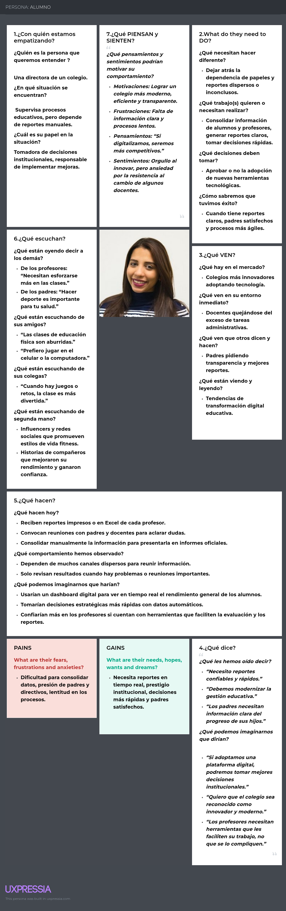
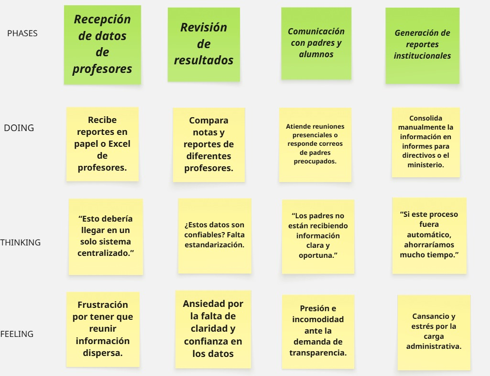

# Informe del Trabajo Final

## Universidad Peruana de Ciencias Aplicadas
### Ingeniería de Software 💻
### Séptimo Ciclo
### Curso: Fundamentos de Arquitectura de Software
### Sección: 1ASI0657
### Docente: Ernesto Ocampo Tello
### Startup: SchoolFit
### Producto: FitMind
### Mes y Año: Septiembre 2025

* Integrantes

    * Stanley Jeremy Gutierrez Tume U202118152
    * Angel Guillermo Berrospi Marin U202114701
    * Javier Kenyi Mendoza Solis U201824550

## Contenido

- [✨ Informe Trabajo Final ✨](#-informe-trabajo-final-)
    - [Universidad Peruana de Ciencias Aplicadas 🎓](#universidad-peruana-de-ciencias-aplicadas-)
  - [Registro de versiones del Informe](#registro-de-versiones-del-informe)
  - [Project Report Collaboration Insights](#project-report-collaboration-insights)
  - [Contenido](#contenido)
  - [Student Outcome](#student-outcome)
- [Capítulo I: Introducción](#capítulo-i-introducción)
  - [1.1. Startup Profile](#11-startup-profile)
  - [1.1.1. Descripción de la Startup](#111-descripción-de-la-startup)
  - [1.1.2 Perfiles de integrantes del equipo](#112-perfiles-de-integrantes-del-equipo)
  - [1.2. Solution Profile](#12-solution-profile)
  - [1.2.1 Antecedentes y problemática](#121-antecedentes-y-problemática)
  - [1.2.2 Lean Ux Process](#122-lean-ux-process)
  - [1.2.2.1. Lean UX Problem Statements](#1221-lean-ux-problem-statements)
  - [1.2.2.2. Lean UX Assumptions](#1222-lean-ux-assumptions)
  - [1.2.2.3. Lean UX Hypothesis Statements](#1223-lean-ux-hypothesis-statements)
  - [1.2.2.4. Lean UX Canvas](#1224-lean-ux-canvas)
  - [1.3 Segmentos Objetivos](#13segmentos-objetivos)
- [Capítulo II: Requeriments Elicitation \& Analysis](#capítulo-ii-requeriments-elicitation--analysis)
  - [2.1. Competidores](#21-competidores)
  - [2.1.1. Análisis competitivo](#211-análisis-competitivo)
  - [2.1.2. Estrategias y tácticas frente a competidores](#212-estrategias-y-tácticas-frente-a-competidores)
  - [2.2. Entrevistas 📝](#22-entrevistas)
  - [2.2.1. Diseño de entrevistas](#221-diseño-de-entrevistas)
  - [2.2.2. Registro de entrevistas](#222-registro-de-entrevistas)
  - [2.2.3. Análisis de entrevistas](#223-análisis-de-entrevistas)
  - [2.3. Needfinding](#23-needfinding)
  - [2.3.1. User Personas](#231-user-personas)
  - [2.3.2. User Task Matrix](#232-user-task-matrix)
  - [2.3.3. Empathy Mapping](#233-empathy-mapping)
  - [2.3.4. As-is Scenario Mapping](#234-as-is-scenario-mapping)
-[Capítulo III: Requirements Specification](#capítulo-iii-requeriments-specification)
  - [3.1. To-Be Scenario Mapping](#31-to-be-scenario-mapping)
  - [3.2. User Stories](#32-user-stories)
  - [3.3. Impact Mapping](#33-impact-mapping)
  - [3.4. Product Backlog](#34-product-backlog)
  - [Conclusiones](#Conclusiones)
  - [Bibliografía](#Bibliografía)
  - [Anexos](#Anexos)
  - [Links](#Links)

## Registro de Versiones del Informe
| Versión | Fecha | Autor | Descripción de modificación |
|---------|-------|-------------|-------|
|  TB1 | 11/09/2025 | -Angel Guillermo Berrospi Marin   -Javier Kenyi Mendoza Solis   - Jeremy | Se han incluido los siguientes capítulos:   - Capítulo I: Introducción   - Capítulo II: Requirements Elicitation & Analysis   - Capítulo III: Requirements Specification |

# Capítulo 1: Introducción

## 1.1 Startup Profile
 
 El perfil de la startup constituye un elemento esencial para definir su identidad y trazar la dirección de su crecimiento. En este apartado se expone no solo la visión y los valores que orientan sus acciones, sino también su propuesta diferencial y la manera en que sobresale dentro del entorno competitivo. Se presentarán los aspectos clave que conforman su esencia, como el origen de la idea, las motivaciones que impulsaron su creación, el problema específico que busca resolver y el enfoque innovador que le otorga una ventaja frente a otros actores. Del mismo modo, se abordarán sus metas en el corto, mediano y largo plazo, junto con las estrategias diseñadas para lograr su expansión y consolidación en el mercado objetivo. Comprender estos elementos resulta indispensable para valorar el potencial de la startup y el impacto que puede generar en su ecosistema.

### 1.1.1 Descripción de la Startup

SchoolFit es una plataforma web innovadora diseñada para transformar la gestión de la educación física en colegios, ofreciendo una solución integral y tecnológica para la planificación, seguimiento y personalización de la actividad deportiva de los estudiantes. La aplicación conecta a administradores, profesores y alumnos mediante herramientas inteligentes que permiten optimizar la organización y el control de las clases y rutinas deportivas.

Entre sus funcionalidades se destacan la creación y administración de perfiles de estudiantes con datos físicos y de rendimiento, la planificación de rutinas personalizadas según la edad y condición física, la gestión de clases con control de asistencia, el registro de evaluaciones y pruebas de rendimiento, la implementación de retos deportivos para motivar la participación estudiantil, el control del equipamiento deportivo y la generación de reportes y analíticas para profesores y directivos.

Esta solución está orientada tanto a instituciones educativas que buscan fortalecer la enseñanza de la educación física, como a docentes que requieren un control más detallado y dinámico del progreso de sus estudiantes. Al digitalizar y mejorar cada etapa del proceso, SchoolFit asegura una mayor eficiencia, motivación y transparencia en el desarrollo de la actividad física escolar, contribuyendo al bienestar integral de los estudiantes y al fortalecimiento de la gestión educativa.

Misión: Nuestra misión en SchoolFit es potenciar la educación física escolar mediante soluciones tecnológicas inteligentes que permitan a instituciones, docentes y estudiantes planificar, monitorear y optimizar su rendimiento deportivo de manera personalizada y eficiente.

Visión: Aspiramos a ser referentes en la innovación educativa, promoviendo un futuro en el que la educación física esté apoyada en la tecnología para fomentar hábitos saludables, mejorar el rendimiento estudiantil y consolidar nuestra presencia en colegios a nivel nacional e internacional.

### 1.1.2 Perfiles de integrantes del equipo

| **Integrante**            | **Angel Guillermo Berrospi Marin** |
|---------------------------|---------------------------------------------------------------------------------------------------|
| **Código del Estudiante** | U202114701                         |
| **Carrera**               | Ingeniería de Software             |
| **Descripción**           | Soy estudiante de Ingeniería de Software. Tendre el compromiso con mi equipo. Cuento con conocimientos en html, css, javascript y SQL, lo cual puede ser de ayuda en el desarrollo del proyecto  |
| Foto                      |    |

| **Integrante**            | **Javier Kenyi Mendoza Solis**                                             |
|---------------------------|---------------------------------------------------------------------------------------------------|
| **Código del Estudiante** | U201824550                                   |
| **Carrera**               | Ingeniería de Software                                                                     |
| **Descripción**           | Estudio la carrera de Ingeniería de Software. Crear programas en entornos distintos para poder ampliar mi conocimiento es de las cosas que me apasionan.      |
| Foto                      |        |

| **Integrante**            | **Stanley Jeremy Gutierrez Tume**  |
|---------------------------|---------------------------------------------------------------------------------------------------|
| **Código del Estudiante** | U202118152                              |
| **Carrera**               | Ingeniería de Software                     |
| **Descripción**           | Me considero una persona responsable y comunicativa, apoyaré en todo lo posible en este trabajo para cumplir los obejtivos del curso.                         |
| Foto                      | |

## 1.2. Solution Profile

### 1.2.1 Antecedentes y problemática

| Elemento        | Descripción                                                                                                                                                              |
|-----------------|--------------------------------------------------------------------------------------------------------------------------------------------------------------------------|
| **Who (Quién)** | Instituciones educativas (colegios), directivos, profesores de educación física y estudiantes que requieren una gestión integral de las actividades deportivas, rutinas personalizadas y un seguimiento eficiente del rendimiento físico.  |
| **What (Qué)**  | Plataforma web que digitaliza y centraliza la gestión de la educación física escolar, incluyendo la administración de usuarios y roles, creación de perfiles de estudiantes con datos físicos y de rendimiento, planificación de rutinas personalizadas, gestión de clases y asistencia, evaluaciones físicas, retos deportivos, control de equipamiento y generación de reportes y analíticas. |
| **Where (Dónde)** | En colegios y centros educativos, tanto en las oficinas de coordinación académica como en las clases de educación física, con acceso desde computadoras o dispositivos móviles para profesores y estudiantes.         |
| **When (Cuándo)** |Durante todo el ciclo escolar: en la planificación de actividades, en la ejecución de clases y rutinas, en la evaluación del rendimiento físico de los estudiantes, y en la elaboración de reportes para el seguimiento y la toma de decisiones.     |
| **Why (Por qué)** | Actualmente, la gestión de la educación física en muchos colegios se realiza de forma manual o con herramientas dispersas (papel, hojas de cálculo), lo que genera pérdida de información, dificultades para personalizar las rutinas, falta de motivación en los estudiantes y poca trazabilidad del rendimiento físico. Esta situación limita el aprovechamiento de la educación física como un espacio clave para el desarrollo integral de los alumnos.|
| **How (Cómo)** | A través de una plataforma digital que permite organizar usuarios y roles, crear y gestionar perfiles de estudiantes, planificar rutinas personalizadas, registrar evaluaciones físicas en tiempo real, implementar dinámicas de gamificación, controlar el equipamiento deportivo y generar reportes automáticos con métricas clave para el seguimiento del progreso estudiantil y la gestión académica. |
| **How Much (Cuánto)** | El acceso a la plataforma se ofrece mediante planes de suscripción mensual o anual para instituciones educativas, ajustados según el número de estudiantes, docentes y funcionalidades activadas. |

### 1.2.2 Lean UX Process.

#### 1.2.2.1. Lean UX Problem Statements.
SchoolFit es una plataforma creada para digitalizar y optimizar la gestión de la educación física en colegios, facilitando la planificación de actividades, el seguimiento del rendimiento de los estudiantes y la personalización de rutinas deportivas. En la actualidad, muchas instituciones aún dependen de registros en papel, hojas de cálculo y métodos manuales que dificultan la organización, generan pérdida de información y limitan la capacidad de los profesores para evaluar de forma integral el progreso físico de los alumnos.

Nuestro mayor desafío es lograr que los colegios y docentes adopten esta solución digital como una herramienta confiable, intuitiva y motivadora. Aunque la propuesta tecnológica ofrece beneficios claros en la personalización, trazabilidad y motivación de los estudiantes, algunos actores del entorno escolar pueden mostrar resistencia al cambio por falta de familiaridad con herramientas digitales o por estar acostumbrados a procesos tradicionales.

¿Cómo podríamos facilitar la adopción de SchoolFit como una herramienta accesible, sencilla y efectiva que transforme la gestión de la educación física, mejore el seguimiento del rendimiento estudiantil y motive a los alumnos a través de la tecnología?

#### 1.2.2.2. Lean UX Assumptions.

-**Contexto**: En muchos colegios, la gestión de la educación física aún se realiza de manera manual, utilizando papel o Excel, lo que genera desorden, pérdida de información y dificultad para hacer seguimiento al progreso de los estudiantes.

-**Assumption**: Digitalizar la gestión de la educación física a través de una plataforma centralizada reducirá errores, facilitará la organización y permitirá un seguimiento más eficiente del rendimiento estudiantil.

-**Contexto**: Los profesores tienen dificultades para personalizar rutinas y actividades de acuerdo con la edad, condición física y necesidades específicas de cada alumno.

-**Assumption**: La planificación de rutinas personalizadas mediante la plataforma permitirá una mejor adaptación a cada estudiante, mejorando su rendimiento y motivación.

-**Contexto**: La falta de herramientas de motivación hace que los estudiantes no siempre se involucren activamente en la educación física, lo que disminuye su interés y compromiso.

-**Assumption**: La implementación de retos deportivos y dinámicas de gamificación aumentará la participación y motivación de los alumnos en las clases.

-**Contexto**: Los reportes manuales de evaluaciones físicas y asistencia consumen mucho tiempo y dificultan la toma de decisiones rápidas por parte de los docentes y directivos.

-**Assumption**: La automatización de reportes y analíticas con métricas clave permitirá a los profesores y administradores tomar decisiones basadas en datos en tiempo real, mejorando la gestión escolar.

-**Contexto**: En el entorno educativo, puede existir resistencia al uso de nuevas tecnologías debido a la falta de experiencia digital por parte de algunos docentes o instituciones.

-**Assumption**: Una interfaz intuitiva, acompañada de capacitación básica y soporte constante, facilitará la adopción de la plataforma y aumentará su uso en el día a día escolar.

- **Contexto**: Las instituciones educativas requieren distintos niveles de acceso a la información (administradores, profesores y estudiantes).

-**Assumption**: Establecer roles personalizados dentro de la plataforma garantizará un manejo seguro de los datos y permitirá que cada usuario acceda únicamente a la información que necesita.

#### 1.2.2.3. Lean UX Hypothesis Statements.

#### Hipótesis 1:

Creemos que al implementar una plataforma que centralice la planificación y el seguimiento de la educación física en colegios, lograremos optimizar la organización de clases y rutinas deportivas, lo que se traducirá en mayor eficiencia administrativa y mejora en el rendimiento de los estudiantes.

**Business Outcome**: Mayor cantidad de instituciones educativas registradas y aumento en la adopción de la plataforma en la gestión diaria.

**Users**:: Directores y administradores de colegios.

**User Outcome**: Mejor control y supervisión de la educación física en la institución.

**Feature**: Panel de gestión institucional, control de clases y asistencia, reportes de desempeño escolar.

#### Hipótesis 2:

Consideramos que si proporcionamos a los docentes herramientas digitales para planificar rutinas personalizadas y registrar evaluaciones, aumentará la calidad pedagógica y la efectividad del seguimiento del progreso físico de los estudiantes.

**Business Outcome**: Incremento en la recurrencia de uso por parte de los profesores y mayor satisfacción docente.

**Users**: Profesores de educación física.

**User Outcome**: Mayor facilidad para planificar clases, evaluar estudiantes y monitorear su rendimiento.

**Feature**: Creación de rutinas personalizadas, registro de evaluaciones, control de asistencia y pruebas físicas.

#### Hipótesis 3:

Suponemos que al ofrecer a los estudiantes acceso a retos deportivos, rutinas personalizadas y visualización de su progreso, se fomentará la motivación, el compromiso y la práctica continua de la actividad física.

**Business Outcome**: Aumento en el nivel de participación estudiantil en clases y retos deportivos.

**Users**: Estudiantes de colegios.

**User Outcome**: Mayor motivación, desarrollo de hábitos saludables y mejora en el rendimiento físico.

**Feature**: Perfil de estudiante con historial de rendimiento, retos deportivos gamificados y seguimiento de logros.

#### Hipótesis 4:

Creemos que al incorporar herramientas de comunicación y reportes automáticos para directivos y padres de familia, mejorará la transparencia y se fortalecerá la confianza en la gestión de la educación física.

**Business Outcome**: Mejores índices de satisfacción institucional y fidelización de colegios en la plataforma.

**Users**: Directores, administradores y padres de familia.

**User Outcome**: Acceso claro a información sobre el rendimiento físico de los estudiantes y confianza en el proceso educativo.

**Feature**: Reportes automatizados, analíticas de progreso, comunicación directa entre docentes y padres.

#### 1.2.2.4. Lean UX Canvas

#### 1.3 Segmentos Objetivos 

**1. Administradores / Directores de Colegios (tomadores de decisiones institucionales)**  
- Directores que buscan optimizar la gestión de la educación física en su institución.  
- Administradores interesados en contar con reportes y analíticas claras para mejorar la toma de decisiones.  
- Instituciones educativas que desean digitalizar el control de asistencia, evaluaciones y recursos deportivos.  
- Colegios que buscan innovar y diferenciarse mediante el uso de tecnología educativa.  

**2. Docentes de Educación Física (usuarios principales de la plataforma)**  
- Profesores que necesitan planificar rutinas deportivas personalizadas según edad y condición física.  
- Docentes que buscan herramientas digitales para registrar evaluaciones, asistencia y pruebas físicas.  
- Profesores interesados en dar un seguimiento continuo al progreso de sus estudiantes.  
- Educadores que desean ahorrar tiempo administrativo y centrarse en mejorar la enseñanza práctica.  

# Capítulo 2: Requeriments Elicitation \& Analysis 

En este capítulo se realizará el proceso de Análisis competitivo y Needfinding necesario para la identificación de las necesidades de nuestro segmento objetivo.  

## 2.1. Competidores

### 2.1.1. Análisis Competitivo

| ¿Por qué llevar a cabo este análisis? | ¿Nuestro servicio tiene lo necesario para poder salir adelante ante sus competidores más conocidos? |

**Competitive Analysis Landscape**

|---------------------------------------|-----------------------------------------------------------------------------------------------------|  
| Para identificar fortalezas, debilidades y diferenciadores de plataformas que también ofrecen soluciones digitales en el ámbito educativo. | Sí. Con un enfoque en la educación física escolar y la personalización de rutinas, SchoolFit puede diferenciarse de plataformas generalistas de gestión escolar o fitness. |  

|                       |  **SchoolFit (Nuestra Startup)** |  **ClassDojo** |  **Edmodo** |  **Google Classroom** |
|-----------------------|-----------------------------------------------------------|---------------------------------------------|-------------------------------------------|--------------------------------------|
| **Perfil / Overview** | Plataforma que centraliza la planificación y seguimiento de educación física en colegios. Gestión de rutinas, evaluaciones, reportes y progreso. | Plataforma de comunicación entre profesores, alumnos y padres. Foco en cultura escolar y motivación. | Red social educativa para compartir materiales, tareas y comunicación docente-estudiante. | Herramienta de Google para gestión de clases, tareas y recursos digitales. |
| **Ventaja Competitiva** | Especialización en educación física. Métricas claras de rendimiento y salud. Integración de reportes automáticos. | Comunicación directa y sencilla con padres y alumnos. Muy extendida en primaria. | Amplia comunidad global y facilidad de uso como red social educativa. | Integración con ecosistema Google (Docs, Drive, Meet). Simplicidad y acceso gratuito. |
| **Mercado Objetivo** | Directores y docentes de educación física en colegios que buscan digitalizar y optimizar la gestión deportiva. | Docentes y colegios interesados en fortalecer la comunicación escuela-hogar. | Profesores que buscan una red social educativa accesible para organizar clases. | Instituciones educativas que ya usan servicios de Google y requieren gestión básica de clases. |
| **Estrategias de Marketing** | Alianzas con colegios, demostraciones en instituciones, marketing en ferias educativas y asociaciones deportivas. | Marketing viral en escuelas primarias y uso gratuito para captar usuarios. | Campañas en comunidades educativas online y alianzas con escuelas internacionales. | Distribución masiva vía integración con Google Workspace for Education. |
| **Productos y Servicios** | Planificación de rutinas deportivas, control de asistencia, evaluaciones físicas, reportes de progreso y métricas institucionales. | Herramientas de comunicación, mensajería, recompensas virtuales para estudiantes. | Compartir tareas, foros de discusión, evaluaciones y materiales. | Publicación de tareas, evaluaciones, integración con apps de Google. |
| **Precios y Costos** | Modelo freemium: funcionalidades básicas gratuitas + plan premium para instituciones (reportes avanzados y analíticas). | Gratis para profesores. Versiones premium para escuelas con funciones extra. | Principalmente gratuito, con funciones premium para instituciones. | Gratuito como parte de Google for Education. |
| **Canales de Distribución** | Plataforma web + app móvil. Acceso vía login institucional. | App móvil y web. | Web y app móvil. | Web y app móvil integrados en Google Workspace. |
| **SWOT - Fortalezas** | Enfoque especializado en educación física, analíticas precisas, diferenciación frente a plataformas generalistas. | Fuerte conexión profesor-padre, gamificación motivacional. | Comunidad amplia, facilidad de uso estilo red social. | Ecosistema Google, confianza de marca, acceso gratuito. |
| **SWOT - Debilidades** | Startup emergente sin comunidad consolidada. Requiere inversión en marketing y adopción inicial. | Limitado a comunicación, no gestiona contenido curricular en detalle. | Pérdida de relevancia en algunos mercados, interfaz desactualizada. | No está diseñado específicamente para educación física ni métricas deportivas. |
| **SWOT - Oportunidades** | Creciente digitalización de colegios, énfasis en salud y deporte escolar, alianzas con ministerios de educación. | Expandirse con funciones adicionales para gestión escolar. | Reposicionar como red social académica más moderna. | Potencial de crecer en regiones con baja penetración de GSuite. |
| **SWOT - Amenazas** | Competidores con gran comunidad ya establecida. Retos en escalabilidad y captación inicial. | Competencia de plataformas más completas. | Riesgo de abandono de usuarios hacia plataformas más integradas. | Posible dependencia excesiva de políticas de Google. |
| **¿Tiene lo necesario para competir?** | Sí. Con su enfoque en educación física, SchoolFit puede diferenciarse frente a plataformas generalistas. Requiere enfocarse en alianzas estratégicas y marketing inicial para posicionarse en colegios. | Sí. Con una base fuerte en escuelas primarias, aunque limitado a comunicación. | Sí. Aún tiene reconocimiento global, pero necesita modernización para competir. | Sí. Gracias al ecosistema Google, aunque sin enfoque específico en deporte o educación física. |

### 2.1.2. Estrategias y tácticas frente a competidores

## 2.2. Entrevistas

### 2.2.1. Diseño de entrevistas

### 2.2.2. Registro de entrevistas

### 2.2.3. Análisis de entrevistas

## 2.3. Needfinding

Para comprender mejor cómo será la experiencia del usuario con nuestro producto, emplearemos herramientas como User Persona, User Task Matrix, User Journey Mapping, Empathy Mapping y As-is Scenario Mapping.

### 2.3.1. User Personas

*PROFESOR:

*DIRECTORA:

### 2.3.2. User Task Matrix

El User Task Matrix desarrollado compara las tareas principales de los dos segmentos objetivo: Docentes de educación física y Administradores/Directores de colegios.

En el caso de los docentes, se observa que las tareas con mayor frecuencia e importancia son la planificación de clases y rutinas, el registro de asistencia, la evaluación del rendimiento físico y la motivación de los alumnos. Estas actividades forman parte de su labor diaria y reflejan la necesidad de herramientas que reduzcan la carga administrativa y les permitan enfocarse en la enseñanza.

Por otro lado, los administradores realizan con alta frecuencia e importancia tareas relacionadas con la generación y revisión de reportes, la comunicación con padres de familia y la toma de decisiones institucionales. Su interés se centra en contar con información consolidada y confiable que les permita supervisar el desempeño estudiantil y garantizar la calidad educativa.

De manera conjunta, se evidencia que la gestión de reportes es una tarea crítica para ambos perfiles: mientras que los docentes los generan, los administradores los consolidan y utilizan para la toma de decisiones. Este hallazgo resalta la importancia de que la solución propuesta facilite la creación de reportes automáticos y dashboards claros, que beneficien tanto la operación docente como la gestión institucional.

# User Task Matrix – Docente - Administrador

| **Tareas (Tasks)** | **Docente – Frecuencia** | **Docente – Importancia** | **Administrador – Frecuencia** | **Administrador – Importancia** |
|---------------------|--------------------------|----------------------------|--------------------------------|---------------------------------|
| Planificar clases y rutinas de educación física | Alta | Alta | Baja | Media |
| Registrar asistencia de alumnos | Alta | Alta | Baja | Media |
| Evaluar rendimiento físico de estudiantes | Alta | Alta | Media | Alta |
| Motivar a los alumnos en la participación | Alta | Alta | Baja | Media |
| Generar reportes de resultados | Media | Alta | Alta | Alta |
| Revisar reportes y consolidar información | Baja | Media | Alta | Alta |
| Comunicar avances a padres de familia | Baja | Media | Media | Alta |
| Tomar decisiones institucionales | Baja | Media | Alta | Alta |
| Gestionar equipamiento deportivo | Media | Media | Baja | Baja |
| Asegurar prestigio y competitividad del colegio | Baja | Media | Alta | Alta |

### 2.3.3. Empathy Mapping

*PROFESOR

.png)

*DIRECTORA:

### 2.3.4. As-is Scenario Mapping

*PROFESOR

*DIRECTORA:

# Capítulo 3: Requirements Specification

### 3.1. To-Be Scenario Mapping

### 3.2. User Stories

### 3.3. Impact Mapping

### 3.4. Product Backlog

# Conclusiones

# Bibliografías

# Anexos

# Links
